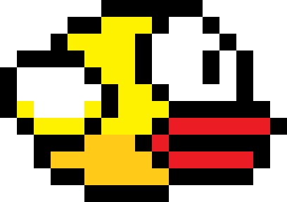

# 🚀 Flappy Boy: The Ultimate Flappy Adventure!

Welcome to **Flappy Boy**, the game where physics is a suggestion and gravity is your worst enemy! 

## 🎮 The Story
In a world full of green pipes and sky-blue backgrounds, one **Boy** (our protagonist) decided to defy the laws of nature. Equipped with nothing but his ability to flap his arms (or whatever those are), he embarks on a journey to avoid pipes and achieve the highest score possible!

## ✨ New Features (Agent-Enhanced!)
- **Dynamic Animations**: Our boy doesn't just sit there; he flaps with purpose through a multi-frame animation system.
- **Physics Tuning**: Smooth rotation and gravity that makes the flight feel as real as a pixelated dream.
- **Interactive Soundtrack**: 
  - 🍄 **Mario Theme Remix** - The soundtrack to your success.
  - 🔊 **SFX Suite** - Every jump, every point, and every... *crash* comes with its own high-quality sound effect.
- **Meme-tastic Game Over Screen**: Experience the ultimate "You Died" moment with a special 4th.png background image that perfectly captures the mood of failure.
- **Accessibility Mode**: We've increased the pipe gap and slowed down the speed. It's now approachable for beginners but still satisfying for pros!

## 🕹️ How to Play
1. **Launch**: Open `index.html` in your favorite browser.
2. **Takeoff**: Press `Space`, `Arrow Up`, or just **Click** to begin.
3. **Flap**: Keep pressing to defy gravity.
4. **Survive**: Avoid the green pipes. If you hit them, prepare for the meme-tastic crash screen!
5. **Restart**: Press `Space` to try again.

## 🛠️ Built With
- **HTML5 Canvas**: For that lightning-fast rendering.
- **Vanilla JavaScript**: Pure logic, no bloated frameworks.
- **Modern CSS**: For those smooth transitions and responsive layouts.

---
*Created with love and adjusted by Antigravity.*
